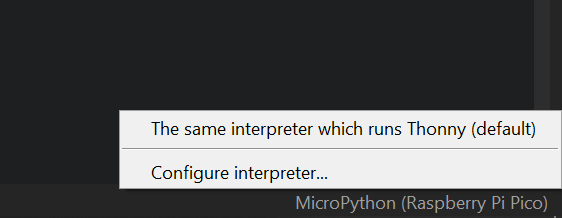

## قم بإعداد Raspberry Pi Pico الخاص بك

قم بتوصيل Raspberry Pi Pico وإعداد MicroPython.

MicroPython هي نسخة من لغة برمجة Python الخاصة بوحدات التحكم الدقيقة ، مثل Raspberry Pi Pico الخاص بك. يتيح لك MicroPython استخدام معرفتك ب Python لكتابة التعليمات البرمجية للتفاعل مع المكونات الإلكترونية.

--- task ---

**اربط** الطرف الصغير من كابل USB الخاص بك إلى Raspberry Pi Pico.

--- /task ---

--- task ---

**اربط** الطرف الآخر بجهاز الكمبيوتر أو الكمبيوتر المحمول أو Raspberry Pi.

--- /task ---

--- task ---

افتح محرر Thonny.

--- /task ---

--- task ---

انظر إلى النص في الزاوية السفلية اليمنى من محرر Thonny. سيظهر لك إصدار Python المستخدم.

إذا لم يقل "MicroPython (Raspberry Pi Pico)" ، فانقر فوق النص وحدد "MicroPython (Raspberry Pi Pico)".

إذا لم يسبق لك استخدام MicroPython على Raspberry Pico ، فسيطالبك Thonny بإضافة البرنامج الثابت MicroPython. Click **Install MicroPython**.

--- /task ---

--- task ---

**التصحيح:**

--- collapse ---
---
title: حدث خطأ أثناء تثبيت البرنامج
---

إذا ظهرت لك رسالة خطأ أثناء التثبيت ، فقم بما يلي:
+ افصل Raspberry Pi Pico الخاص بك
+ أعد توصيل Raspberry Pi Pico الخاص بك
+ حاول تثبيت البرنامج الثابت مرة أخرى (قد تحتاج إلى الضغط على زر الإيقاف أولا)

--- /collapse ---

--- collapse ---
---
title: لا أعرف ما إذا كان البرنامج مثبتا ولا يمكن الاتصال ب Pico الخاص بي
---

تأكد من توصيل Raspberry Pi Pico بالحاسوب باستخدام كبل micro USB. انقر على القائمة الموجودة في الزاوية السفلية اليمنى من نافذة Thonny الخاصة بك. ستظهر قائمة منبثقة تسرد مترجمي اللغة البرمجية المتاحين.

إذا لم تتمكن من رؤية Pico في القائمة (كما هو الحال في الصورة) ، فستحتاج إلى إعادة توصيل Raspberry Pi Pico أثناء الضغط على زر BOOTSEL لتثبيته كوحدة تخزين ، وإعادة تثبيت البرنامج باتباع الإرشادات الواردة في القسم أعلاه.

--- /collapse ---

--- collapse ---
---
title: تم تثبيت البرنامج ولكن ما زلت لا أستطيع الاتصال بجهاز Pico الخاص بي
---

ربما تستخدم نوعًا خاطئًا من كبل micro USB. قد يكون كبل micro USB الحالي تالفا أو مصمما فقط لنقل الطاقة إلى الأجهزة ولا يمكنه نقل البيانات. حاول تبديل الكابل إذا لم ينجح أي شيء آخر.

إذا كان جهاز Pico الخاص بك لا يزال غير متصل بعد تجربة كل هذه الأشياء ، فقد يكون **الجهاز نفسه** تالفًا وغير قادر على الاتصال.

--- /collapse ---

يمكنك العثور على مزيد من المعلومات في [دليل استخدام Raspberry Pi](https://projects.raspberrypi.org/en/projects/introduction-to-the-pico){: target = "_ blank"}.

--- /task ---

`picozero` هي مكتبة MicroPython للمبتدئين في Raspberry Pi Pico.

--- task ---

لإكمال المشاريع في هذا المسار ، ستحتاج إلى تثبيت مكتبة `picozero` كحزمة لمحرر Thonny.

في محرر Thonny، اختر **Tools** > **Manage packages**.

--- /task ---

--- task ---

في النافذة المنبثقة 'Manage packages لـ Raspberry Pi Pico'، اكتب `picozero` وانقر فوق **Search on PyPi**.

--- /task ---

--- task ---

انقر على **picozero** في نتائج البحث.

أنقر على **Install**.

عند اكتمال التثبيت، أغلق نافذة الحزمة، ثم قم بإغلاق محرر Thonny وإعادة فتحه.

--- /task ---

إذا واجهت صعوبات في تثبيت مكتبة `picozero` في محرر Thonny ، فيمكنك تنزيل ملف المكتبة وحفظه في Raspberry Pi Pico.

[[[picozero-offline-install]]]
