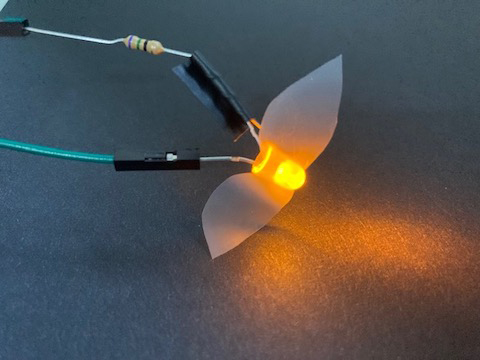

## أشعل اليراعة الخاص بك

في هذه الخطوة، ستستخدم أسلاك التوصيل لتوصيل مصباح LED بمقاوم وربطها مع جهاز Raspberry Pi Pico الخاص بك وكتابة تعليمات برمجية لإضاءته. 

! [Raspberry Pi Pico بسلكين توصيل متصلين بمصباح LED أصفر.] (images / firefly-on.jpg) {: width = "300px"}

--- task ---

تأكد من أن لديك مصباح LED متصل بمقاومة وسلكي توصيل مقبس-مقبس. لا يهم لون الاسلاك، فجميعهم يفعلون الشيء نفسه.

عادة ما تكون اليراعات صفراء أو برتقالية أو خضراء ولكن يمكنك اختيار أي لون تريده.

تتحكم **المقاومة** في التيار الذي يتدفق عبر الدائرة. هذا يحمي مصباح LED من الاحتراق وسيجعله يدوم لفترة أطول.

إذا لم يكن مصباح LED الخاص بك يحتوي على أسلاك توصيل ومقاومة متصلة، فيمكنك إضافتها:

[[[led-resistor-electrical-tape]]]

[[[led-resistor-solder-heat-shrink]]]

--- /task ---

يحتوي Raspberry Pi Pico على **40 دبوسًا** على لوحه. تسمح لك **الدبابيس** بتوصيل المكونات الخارجية بـ Raspberry Pi Pico.

--- task ---

استكشف Raspberry Pi Pico وابحث عن الدبوس المسمى **GP13**. ستلاحظ وجود عناوين لكل دبوس موجودة بالجهة **السفلى** من Raspberry Pi Pico.

--- /task ---

--- task ---

**اربط** سلك التوصيل المتصل بالساق الموجبة من مصباح LED (السلك الذي يحتوي على المقاومة) بالدبوس **GP13**. ادفعه حتى يلتقي البلاستيك الأسود بقاعدة الرأس.

**اربط** سلك التوصيل المتصل بالساق السالبة بـ **GND** (أرضي) ، اسفل من **GP13**. هذا يكمل الدائرة، مما يسمح للتيار الكهربائي بالتدفق عندما تطلب منه التعليمات البرمجية الخاصة بك.

--- /task ---

--- task ---

في الخطوة الأخيرة ، استخدمت `pico_led` لإضاءة مصباح LED على Raspberry Pi Pico. لإضافة مصابيح LED الخاصة بك ، تحتاج إلى `استيراد` `LED` من `picozero`.

أضف `، LED` إلى نهاية قائمة الاستيراد في **سطر 1**. بعد ذلك ، اضبط مصباح اليراعة على **GP13** وأدخل التعليمات البرمجية لتشغيله.

أدخل التعليمات البرمجية لإضاءة اليراع الخاص بك:

--- code ---
---
language: python filename: firefly.py line_numbers: true line_number_start: 1
line_highlights: 1,8-9
---
from picozero import pico_led, LED from time import sleep

pico_led.on() sleep(1) pico_led.off()

firefly = LED(13) # Use GP13 firefly.on() --- /code ---

**نصيحة:** لاستيراد عدة عناصر ، افصل بينها بفاصلات`,`.

--- /task ---

--- task ---

**الاختبار:** قم بتشغيل التعليمات البرمجية الخاصة بك لترى مصباح LED الخاص بك يضيء.

**تصحيح**:

--- collapse ---
---
title: التعليمات البرمجية الخاصة بي لا تعمل
---

إذا كانت التعليمات البرمجية الخاصة بك لا تعمل:
+ أصلح أي أخطاء في التعليمات البرمجية الخاصة بك. سيومض مؤشر LED الموجود على Raspberry Pi Pico إذا تم تشغيل التعليمات البرمجية الخاصة بك بنجاح.

--- /collapse ---

--- collapse ---
---
title: مصباح اليراعة الخاص بي لا يضيء
---

إذا لم يضيء مصباح LED الخاص بك:
+ تحقق من أن الجانب السالب لمصباح LED الخاص بك (الأقصر ، المسطح) متصل بـ **GND** والجانب الموجب (الأطول ، مع المقاوم) متصل بـ **GP13**
+ تأكد من أن جميع المفاصل متصلة بشكل جيد
+ جرب مصباح LED مختلف

--- /collapse ---

--- /task ---

--- task ---

**اختياري:** قص بعض الأجنحة مطوية فوق شريط لاصق وألصقها بمؤشر LED. الشريط غير المرئي يعمل بشكل جيد.

--- /task ---
