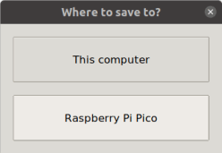

## Light the Pico LED

Light the tiny LED that sits on the top of your Raspberry Pi Pico.

{:width="300px"}

--- task ---

Look at your Raspberry Pi Pico and find the small LED next to the USB connector. 

{:width="200px"}

--- /task ---

In the last step you installed the **picozero** library. This library allows you to program electronics components that are attached to a Raspberry Pi Pico. At the top of your code, you will need to import the items that you need from the **picozero** library.

--- task ---

Type the following code into the main editor pane in Thonny:

--- code ---
---
language: python
filename: firefly.py
line_numbers: true
line_number_start: 
line_highlights: 
---
from picozero import pico_led 

pico_led.on()

--- /code ---

--- /task ---

--- task ---

Choose 'File->Save As'. Thonny will ask whether you want to save the file on **This computer** or the **MicroPython device**. Choose **MicroPython device** to save your code to the Raspberry Pi Pico. 

Name your file 'firefly.py'.

--- /task ---

--- task ---

**Test:** Thonny has a green play button with a small white triangle inside it. Pressing this button allows you to run your code. 

+ Press the play button.  

+ Check that the small LED on the Raspberry Pi Pico turns on. 

{:width="200px"}

**Debug:** 

If you don't see a green play button (it is faded):
+ check that your Raspberry Pi Pico is connected to your computer

If Thonny is saying that there is an error in your code:
+ check your code very carefully and make sure it matches the example.

If you have fixed all of the errors in your code and the light doesn't come on:
+ try a different USB cable, making sure that it is a **data** USB cable.
+ as a last resort, try another Raspberry Pi Pico (if you have a spare)

--- /task ---

--- task ---

Import `sleep` to allow you to pause your code. Add code to the end of your script to sleep for one second and then turn the LED off. 

--- code ---
---
language: python
filename: 
line_numbers: true
line_number_start: 1
line_highlights: 2,5-6
---
from picozero import pico_led
from time import sleep

pico_led.on()
sleep(1)
pico_led.off()
--- /code ---

--- /task ---

--- task ---

**Test:** Click the green flag. Thonny will save the file on your Raspberry Pi Pico and then run the new code. 

Check that the LED turns on and then goes off again. Run your code as many times as you like. 

{:width="300px"}

**Debug:**

If Thonny says "'sleep' isn't defined":
+ Add the `from time import sleep` line. 

--- /task ---

--- save ---