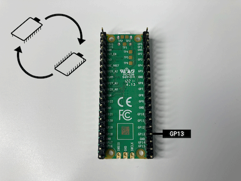

## Light your firefly

Connect and light an LED and a resistor to your Raspberry Pi Pico using jumper wires. 

Image, gif or video showing what they will achieve by the end of the step. {:width="300px"}

LED stands for light emitting diode. It uses electroluminescence, which is where a material lights up when an electrical current passes through it. An LED has two legs, a long one and a short one and must be connected the right way around. The long leg is positive (+) leg and the short one is the negative (-). Another way to check if a leg is positive or negative is to use your finger to find the flat side of the LED bulb. The flat side is on the same side as the negative leg.

--- task ---

Make sure that you have an LED connected to a resistor and two socket-socket jumper wires. The colour of the jumper wires does not matter, they all do the same thing.  

Fireflies are usually yellow, orange or green but you can choose any colour you like.

[[[led-resistor-electrical-tape]]]

[led-resistor-heatshrink]

--- /task ---

A resistor controls the current that flows through a circuit. This protects the LED from burning out and will make it last longer. 

A Raspberry Pi Pico has **40 pins** on its board. **Pins** allow you to connect external components to the Raspberry Pi Pico.  

--- task ---

Explore your Raspberry Pi Pico and find the pin that is labelled **GP13**. You will notice that there are labels for each pin on the **underneath** side of the Raspberry Pi Pico. 

--- /task ---

--- task ---

 
Connect the jumper wire that is attached to the positive leg of the LED (the one with the resistor) to pin **GP13**. Push it until the black plastic meets the base of the header and that it is secure. 

--- /task ---

A firefly is a kind of beetle, also called a glowworm or lightning bug, which flashes using bioluminescence to identify themselves to other members of the same species. Different species flash in different patterns. 

--- task ---

Connect the jumper wire that is attached to the negative leg to the **GND** pin, below GP13. This completes the circuit, allowing electrical current to flow when instructed by your code.    

--- /task ---

--- task ---

In the last step you used `pico_led` to light the LED on the Raspberry Pi Pico. If you want to add your own LEDs then you need to `import` LED from picozero. 

Add `LED` to the end of the import list on **line 1**. Next, set your firefly LED to **GP13** and enter the code to switch it on. 

Enter the code to light your firefly: 

--- code ---
---
language: python
filename: 
line_numbers: true
line_number_start: 1
line_highlights: 1,8-9
---
from picozero import pico_led, LED
from time import sleep

pico_led.on()
sleep(1)
pico_led.off()

firefly = LED(13)
firefly.on()
--- /code ---

--- /task ---

--- task ---
**Test** Run your code and your LED firefly should light up. 

**Debug**:

If your code isn't running:
+ Fix any errors in your code. The LED on the Raspberry Pi Pico will flash if your code runs successfully.

If your LED firefly does not light up:
+ Check that your LED has the negative (shorter, flat) side attached to GND and the positive (longer, with resistor) side attached to GP13
+ Make sure that all joints are making a good connection. 
+ Try a different LED.

--- /task ---

--- task ---
**Optional:** Cut some wings out of sticky tape and stick them to your LED. Invisible tape works well. 

--- /task ---

--- save ---