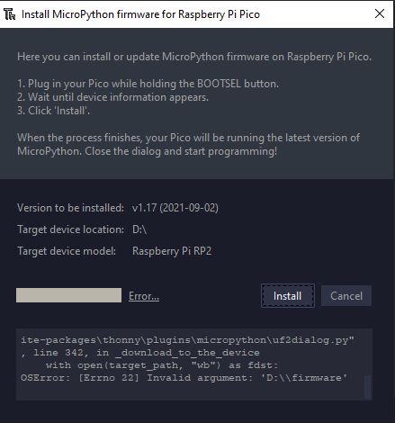

## Configurer ton Raspberry Pi Pico

Connecte ton Raspberry Pi Pico et configure MicroPython.

MicroPython est une version du langage de programmation Python pour les microcontrôleurs, tels que ton Raspberry Pi Pico. MicroPython te permet d'utiliser tes connaissances Python pour écrire du code afin d'interagir avec les composants électroniques.

--- task ---

**Connecte** la petite extrémité de ton câble USB au Raspberry Pi Pico.

--- /task ---

--- task ---

**Connecte** l'autre extrémité à ton ordinateur, ordinateur portable ou Raspberry Pi.

--- /task ---

--- task ---

Ouvre l'éditeur Thonny.

--- /task ---

--- task ---

Regarde le texte dans le coin inférieur droit de l'éditeur Thonny. Il te montrera la version de Python utilisée.

S'il ne dit pas « MicroPython (Raspberry Pi Pico) », clique sur le texte et sélectionne « MicroPython (Raspberry Pi Pico) ».

Si tu n'as jamais utilisé MicroPython sur ton Raspberry Pi Pico, alors Thonny te demandera d'ajouter le firmware MicroPython. Click **Install MicroPython**.

--- /task ---

--- task ---

**Déboguer :**

--- collapse ---
---
title: Une erreur s'est produite lors de l'installation du firmware
---

Si tu vois un message d'erreur lors de l'installation, alors :
+ Déconnecte ton Raspberry Pi Pico
+ Reconnecte ton Raspberry Pi Pico
+ Essaie d'installer à nouveau le firmware (tu devras peut-être d'abord appuyer sur le bouton d'arrêt)

--- /collapse ---

--- collapse ---
---
title: Je ne sais pas si le firmware est installé et je n'arrive pas à me connecter à mon Pico
---

Assure-toi que ton Raspberry Pi Pico est connecté à ton ordinateur avec un câble micro USB. Clique sur la liste dans le coin inférieur droit de ta fenêtre Thonny. Un menu contextuel apparaîtra, qui répertorie les interprètes disponibles.

Si tu ne vois pas le Pico dans la liste (comme sur l'image), tu devras reconnecter ton Raspberry Pi Pico tout en maintenant le bouton BOOTSEL pour le monter en tant que volume de stockage, et réinstaller le firmware en suivant les instructions de la section ci-dessus.

--- /collapse ---

--- collapse ---
---
title: Le firmware est installé mais je ne parviens toujours pas à me connecter à mon Pico
---

Tu utilises peut-être le mauvais type de câble micro USB. Ton câble micro USB actuel est peut-être endommagé ou conçu uniquement pour alimenter les appareils et ne peut pas transférer de données. Essaie d'échanger ton câble si rien d'autre n'a fonctionné.

Si ton Pico ne se connecte toujours pas après avoir essayé toutes ces choses, il se peut qu'il soit **lui-même** endommagé et incapable de se connecter.

--- /collapse ---

Tu trouveras de plus amples informations dans le [Guide Raspberry Pi Pico](https://projects.raspberrypi.org/en/projects/introduction-to-the-pico){:target="_blank"}.

--- /task ---

`picozero` est une bibliothèque MicroPython pour les débutants au Raspberry Pi Pico.

--- task ---

Pour terminer les projets de ce parcours, tu devras installer la bibliothèque `picozero` en tant que paquet de Thonny.

Dans Thonny, choisis **Outils** > **Gérer les paquets**.

--- /task ---

--- task ---

Dans la fenêtre contextuelle « Gérer les paquets pour Raspberry Pi Pico », tape `picozero` et clique sur **Rechercher sur PyPi**.

--- /task ---

--- task ---

Clique sur **picozero** dans les résultats de la recherche.

Clique sur **Installer**.

Une fois l'installation terminée, ferme la fenêtre du paquet, puis quitte et rouvre Thonny.

--- /task ---

Si tu rencontres des difficultés pour installer la bibliothèque `picozero` dans Thonny, tu peux télécharger le fichier de la bibliothèque et l'enregistrer sur ton Raspberry Pi Pico.

[[[picozero-offline-install]]]
