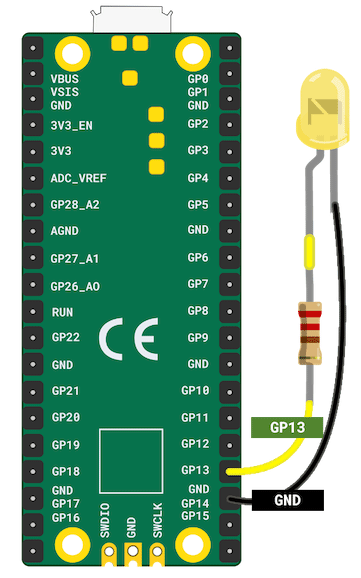

## Allumer ta luciole

Dans cette étape, tu utiliseras des fils de liaison pour connecter une LED avec une résistance à ton Raspberry Pi Pico et écrire du code pour l'allumer. 

{:width="300px"}

--- task ---

Assure-toi que tu as une LED connectée à une résistance et deux fils de liaison prise-prise. La couleur des fils de liaison n'a pas d'importance, ils font tous la même chose.

Les lucioles sont généralement jaunes, orange ou vertes, mais tu peux choisir la couleur de ton choix.

Une **résistance** contrôle le courant qui circule dans un circuit. Cela permet d'éviter que la LED ne s'éteigne et de la faire durer plus longtemps.

Si ta LED n'a pas de fils de liaison ni de résistance, tu peux les ajouter :

[[[led-resistor-electrical-tape]]]

[[[led-resistor-solder-heat-shrink]]]

--- /task ---

Un Raspberry Pi Pico a **40 broches** sur sa carte. **Pins** te permettent de connecter des composants externes au Raspberry Pi Pico.

--- task ---

Explore ton Raspberry Pi Pico et trouve la broche étiquetée **GP13**. Tu remarqueras qu'il y a des étiquettes pour chaque broche sur la face **inférieure** du Raspberry Pi Pico.

--- /task ---

--- task ---

**Connecte** le fil de liaison qui est attaché à la patte positive de la LED (celle avec la résistance) à la broche **GP13**. Pousse-le jusqu'à ce que le plastique noir rencontre la base de l'en-tête.

**Connecte** le fil de liaison qui est attaché à la patte négative au **GND** (masse), en dessous de **GP13**. Cela complète le circuit, permettant au courant électrique de circuler lorsque ton code te l'indique.

--- /task ---

--- task ---

Dans la dernière étape, tu as utilisé `pico_led` pour allumer la LED sur le Raspberry Pi Pico. Pour ajouter tes propres LED, tu dois `import` `LED` from `picozero`.

Ajoute `, LED` à la fin de la liste d'importation sur la **ligne 1**. Ensuite, mets ta luciole LED sur **GP13** et entre le code pour l'allumer.

Entre le code pour allumer ta luciole :

--- code ---
---
language: python filename: firefly.py line_numbers: true line_number_start: 1
line_highlights: 1,8-9
---
from picozero import pico_led, LED from time import sleep

pico_led.on() sleep(1) pico_led.off()

firefly = LED(13) # Use GP13 firefly.on() --- /code ---

**Astuce :** Pour importer plusieurs éléments, sépare-les par des virgules `,`.

--- /task ---

--- task ---

**Test :** exécute ton code pour voir ta luciole LED s'allumer.

**Déboguer** :

--- collapse ---
---
title: Mon code ne s'exécute pas
---

Si ton code ne s'exécute pas :
+ Corrige toutes les erreurs dans ton code. La LED sur le Raspberry Pi Pico clignotera si ton code s'exécute avec succès.

--- /collapse ---

--- collapse ---
---
title: Ma luciole LED ne s'allume pas
---

Si ta luciole LED ne s'allume pas :
+ Vérifie que ta LED a le côté négatif (plus court, plat) attaché à **GND** et le côté positif (plus long, avec résistance) attaché à **GP13**
+ Assure-toi que tous les joints font une bonne connexion
+ Essaie une autre LED

--- /collapse ---

--- /task ---

--- task ---

**Facultatif :** Découpe des ailes dans du ruban adhésif plié et colle-les sur ta LED. Le ruban invisible fonctionne bien.

--- /task ---
